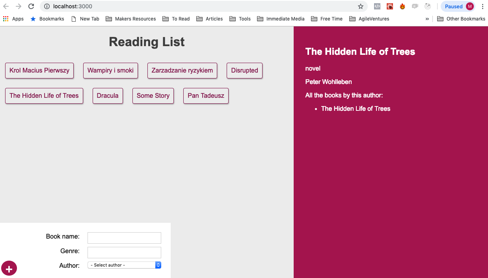

## Bookmanager GraphQL app

### Project information

This app is build by following YouTube tutorial on GraphQL. It has Express on the server side communicating with MongoDB
and React app with Apollo and GraphQL in between to fetch and store data using GraphQL schema and queries. Mongose enable to communicate with Mongo and store data. There is a touch of CSS styling as well

### Instruction
- ```git clone``` the project repo
- ```cd bookmanager-graphql && npm i``` to change into project folder and install project dependencies
- ```cd server && nodemon server.js``` to run server
- ```cd client && npm run start``` to kickstart FE application

### Steps completed
- used class React components
- used ***create-react-app** to scaffold application
- ***react-apollo*** to connect graphql query results with components via {graphql, compose}
- ***apollo-boost*** to create GraphQL queries with { gql }
- ***ApolloProvider*** middleware from ***react-apollo*** to wrap main App.js component

### Screenshot
